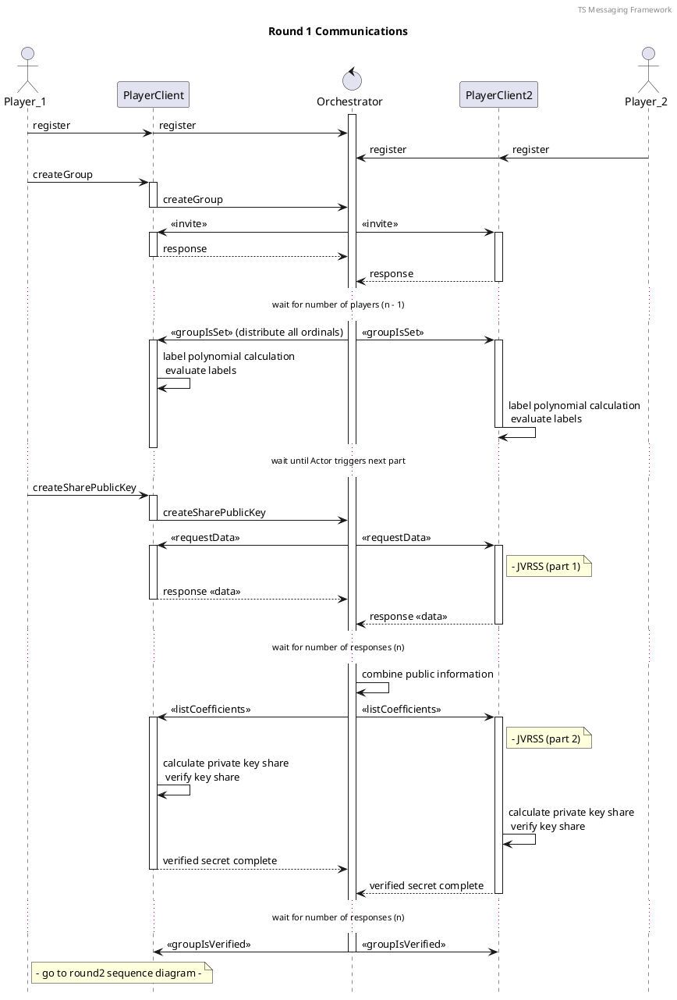
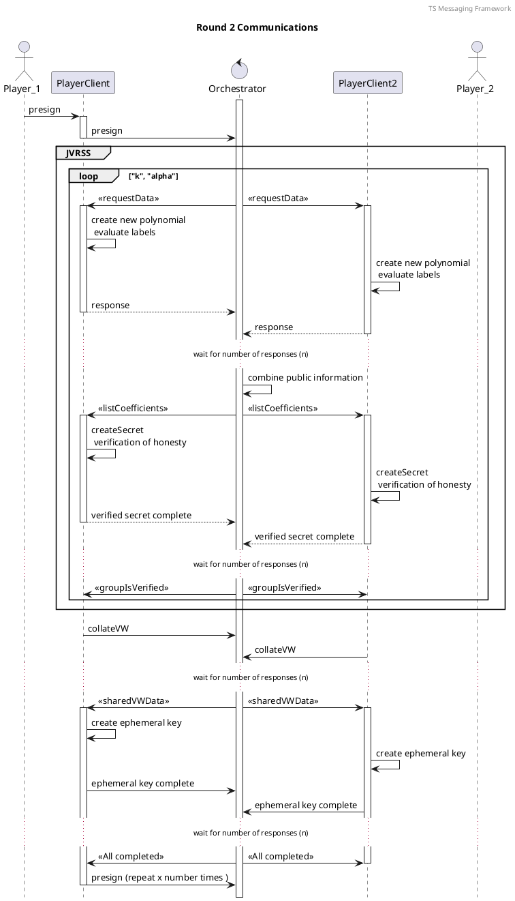
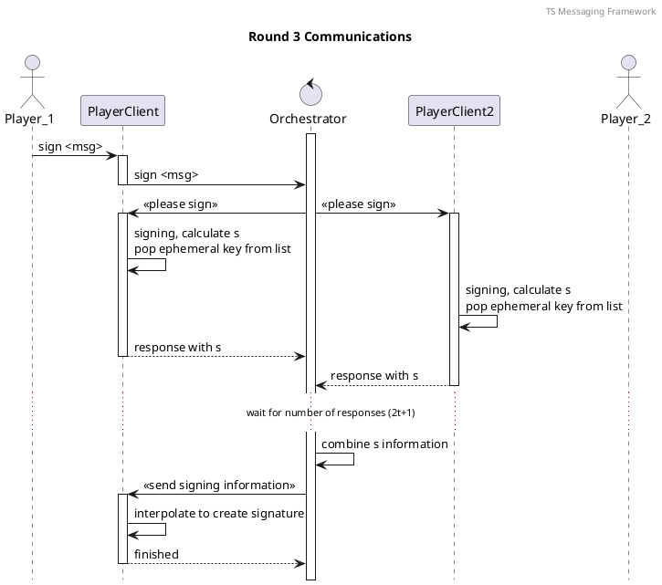

## Elliptic Curve Maths

TODO : fill in content for elliptic curve math, ecdsa

## Polynomial Maths

TODO : fill in content for polynomial definitions and interpolation

## Key Management

TODO : fill in content for key management

## Secret Key Sharing

TODO : fill in content for key sharing

## Symmetric Encryption

TODO : fill in content encrypt/decrypt

## Threshold Signatures

TODO : fill in content for math and protocol part of the Threshold signature

#### Sequence diagram round 1

#### Sequence diagram round 2

#### Sequence diagram round 3
