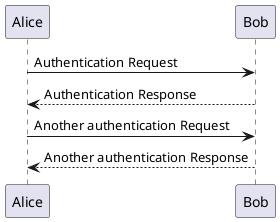
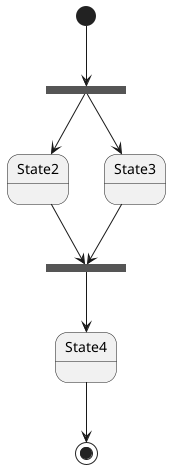
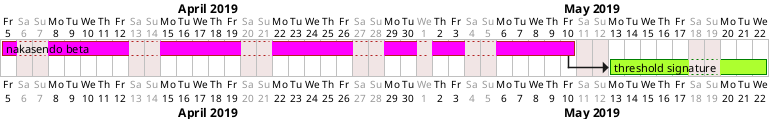

# Demo mkdocs capacities
Look at markdown extensions to see:

- [Internal linking](#internal-linking)
- [Code listing](#code-listing)
- [Math latex katex](#math-latex)
- [PlantUML diagrams](#plantuml)
- [Other interesting diagrams](#other-interesting-diagrams)
- [Other interesting extensions](#other-interesting-extensions)

## Internal linking
mkdocs automatically convert all session header to lower characters and concatenate using '-' to make and internal linking reference. Example a chapter is written as follow
```
## My section 1
...
## My section 2
...
## My section n
```

Then the summary at the begining of the section would be:
```
Summary
- [My section 1](#my-section-1)
- [My section 2](#my-section-2)
- [My section n](#my-section-n)
```


## Code listing
C++
```c++
const std::string hello {};
```

## Math latex
Assuming the pymdown-extensions has been installed. The mkdocs.yml files need to include the following for MathJAX functions
```
markdown_extensions:
  - pymdownx.arithmatex
extra_javascript:
  - 'https://cdnjs.cloudflare.com/ajax/libs/mathjax/2.7.0/MathJax.js?config=TeX-MML-AM_CHTML' # mathjax
```
The math formula `$a^2+b^2=c^2$` will give inline math $a^2+b^2=c^2$. And the new line math formula
```latex
$$
f(x) = \int_{-\infty}^\infty \hat f(\xi)\,e^{2 \pi i \xi x} \,d\xi \frac{n!}{k!(n-k)!} = \binom{n}{k}
$$
```
will give the out line math formula
$$
f(x) = \int_{-\infty}^\infty \hat f(\xi)\,e^{2 \pi i \xi x} \,d\xi \frac{n!}{k!(n-k)!} = \binom{n}{k}
$$


## PlantUML
[Plantuml](https://plantuml.com/) has quite a lot of functionalities to draw diagrams. An online test guid can be found at [planttext](https://www.planttext.com/). First, the [plantuml-markdown](https://github.com/mikitex70/plantuml-markdown) need to be installed
```bash
prompt$> python -m pip install plantuml-markdown
```
mkdocs.yml file :
```none
markdown_extensions:
  - plantuml_markdown:
      server: http://www.plantuml.com/plantuml  # PlantUML server, for remote rendering
      format: png                               # default diagram image format
      classes: class1,class2                    # default diagram classes
      title: UML diagram                        # default title (tooltip) for diagram images
      alt: UML diagram image                    # default `alt` attribute for diagram images
      priority: 30                              # plugin priority; the higher, the sooner will be applied (default 30)
```
#### [sequence diagram](https://plantuml.com/sequence-diagram) :
```
    @startuml
    Alice -> Bob: Authentication Request
    Bob --> Alice: Authentication Response
    Alice -> Bob: Another authentication Request
    Alice <-- Bob: Another authentication Response
    @enduml
```



#### [state diagram](https://plantuml.com/state-diagram) :
```
@startuml
state fork_state <<fork>>
[*] --> fork_state
fork_state --> State2
fork_state --> State3
state join_state <<join>>
State2 --> join_state
State3 --> join_state
join_state --> State4
State4 --> [*]
@enduml
```



## Other interesting diagrams
#### [grantt diagram](https://plantuml.com/gantt-diagram) :
```
@startgantt
project starts the 2019/04/05
saturday are closed
sunday are closed
2019/05/01 is closed
2019/04/17 to 2018/04/19 is closed
[nakasendo beta] lasts 25 days
[threshold signature] lasts 8 days
[threshold signature] starts at [nakasendo beta]'s end
[nakasendo beta] is colored in Fuchsia/FireBrick 
[threshold signature] is colored in GreenYellow/Green 
@endgantt
```



## Other interesting extensions

## TODO
- theming