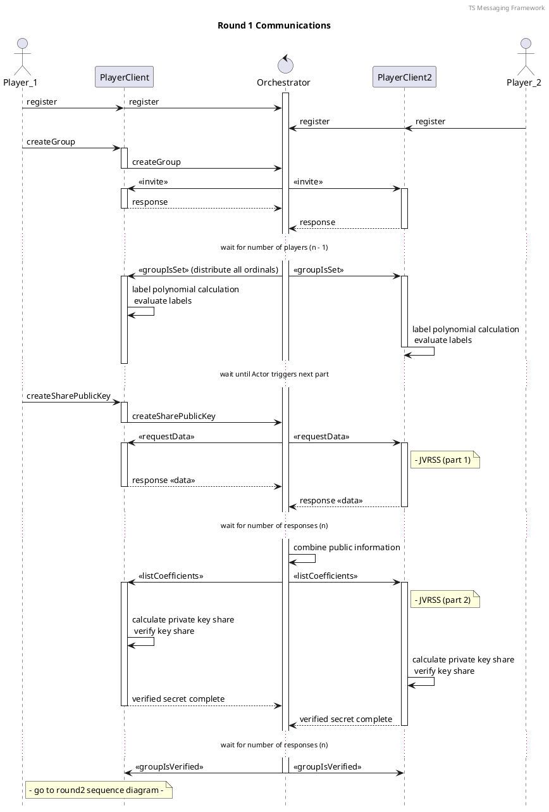
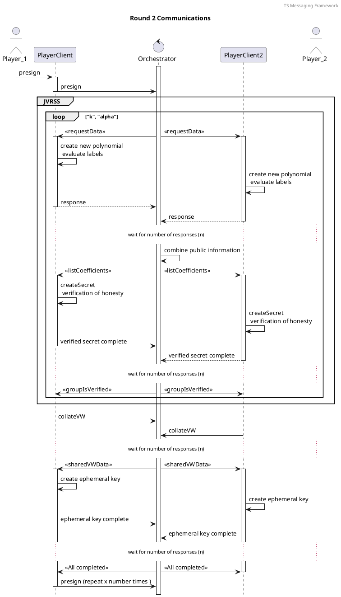
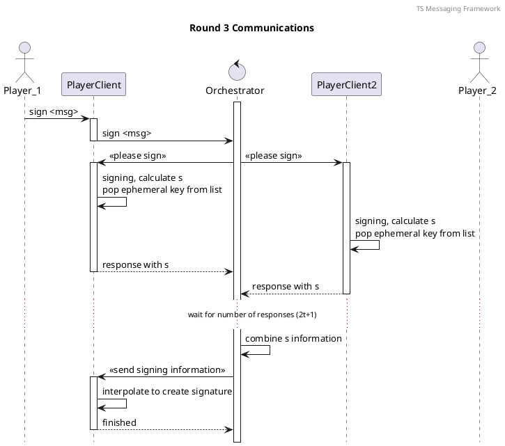

## Elliptic Curves

In Bitcoin, private/public key pairs are based on elliptic curves groups. An elliptic curve $E$ satisfies the equation

\begin{equation}
y^2 \equiv x^3 + ax + b \bmod p
\end{equation}

where $a, b \in \mathbb{Z}_p$ for some prime $p$, satisfying $4a^3 + 27b^2 \neq 0$. The group over this elliptic curve is defined to be $E \cup \{ {\mathcal{O}} \}$ where $\{ {\mathcal{O}} \}$, is the identity element called the point at ininity, and the elements of $E$ are of the form $(x,y)$ satisfying the equation above. The group $E \cup \{ {\mathcal{O}} \}$ under point addition $'+'$ has order $n$ and we will denote a generator of this group by $G$. 

For a point $G\in E \cup \{ {\mathcal{O}} \}$ and a scalar $d \in \mathbb{Z}_n$, point scalar multiplicaion is written as $d\cdot G$ and defined to be the point $G$ added to itself $d$ times. Given a point $d\cdot G$, it is computationally infeasible to calculate $d$. 

In Bitcoin, private keys are chosen to be this value $d$, and the public keys are then $d\cdot G$. The elliptic curve is chosen to be the secp256k1 curve, which has the following parameters:

$$a=0$$

$$b=7$$

$$p=2^{256}-2^{32}-2^9-2^8-2^7-2^6-2^4-1$$

$$n=\mathrm{FFFFFFFF \; FFFFFFFF \; FFFFFFFF \; FFFFFFFE \; BAAEDCE6 \; AF48A03B \; BFD25E8C \; D0364141}$$

$$G=\mathrm{ (79BE667E \; F9DCBBAC \; 55A06295 \; CE870B07 \; 029BFCDB \; 2DCE28D9 \; 59F2815B \; 16F81798, \\ \; 483ADA77 \; 26A3C465 \; 5DA4FBFC \; 0E1108A8 \; FD17B448 \; A6855419 \; 9C47D08F \; FB10D4B8) }$$

Private keys can be used to create signatures on a message, that can be verified against the corresponding public key. 

## Elliptic Curve Digital Signature Algorithm

In order to create a signature on a message $M$, with the private key $d$, the following steps are taken. 

1. Calculate the message digest $e = \mathrm{SHA256}\left(\mathrm{SHA256}(M)\right)$, where $\mathrm{SHA256}(\bullet)$ is the SHA256 hash function.
2. Chose a random integer $k \in \{1,\ldots, n-1\}$, where $n$ is the order of the secp256k1 curve. We will refer to $k$ as the ephemeral key.
3. Calculate the ephemeral public key corresponding to this ephemeral private key 
$$ k \cdot G = (x,y) \; . $$
4. Caclulate $r=x \bmod n$. If $r=0$, return to step 1.
5. Calculate the multiplicative inverse of the ephemeral key $k^{-1}$ modulo $n$.
6. Caclulate $s=k^{-1}(e+ar) \bmod n$. If $s=0$, return to step 1.
7. The signature on the message $M$ is $(r,s)$.

The ephemeral key must be kept secret, otherwise the private key can be calculated given a message and signature. Additionally, each time a signature is generated, a different ephemeral key must be used. If this is not the case, it is possible to derive the private key $d$ given two different signatures and their corresponding messages.

Given a messae $M$, a public key $d\cdot G$, and corresponding signature $(r,s)$, then one can verify the signature by completing the following steps.

1. Calculate the message digest $e=\mathrm{SHA256}(\mathrm{SHA256}(M))$.
2. Calculate the multiplicative inverse $s^{-1}$ of $s$ modulo $n$.
3. Calculate $j_1=es^{-1} \bmod n$ and $j_2=rs^{-1} \bmod n$.
4. Calculate the point $Q=j_1\cdot G+j_2 (d\cdot G)$.
5. If $Q=\mathcal{O}$, the point at infinity, the signature is invalid. 
6. If $Q\neq \mathcal{O}$, then let $Q:=(x,y)$, and calculate $t=x \bmod n$. If $t=r$, the signature is valid.

It is possible to split the private key $d$ into key shares, that can be distributed among parties, and then set a threshold number of parties who can come together to sign a message in the way described above. This process of splitting a key and calculating a signature uses concepts of polynomials. 

## Polynomials

A polynomial of order $t$ has the form 

\begin{equation}
f(x) = a_0 + a_1x + \ldots + a_{t-1}x^{t-1} + a_t x^t \bmod n 
\end{equation}

and points on this polynomial will be denoted by 

\begin{equation}
(x_i, y_i) 
\end{equation}

where $y_i = f(x_i)$.

The zeroth order of the polyomial will correspond to the shared private key $d$. Each participant's key share is a point on this polynomial $(x_i,y_i)$ where $i=1,\ldots ,M$, and $M$ is the number of participants.
It is possible to use $t+1$ of these points to recalculate the polynomial. This is done using Lagrange interpolation.

### Lagrange Interpolation

In order to calculate an order-$t$ poylnomial, given at least $t+1$ points labelled

\begin{equation}
(x_1, y_1), \ldots, (x_{t+1}, y_{t+1}) 
\end{equation}

on the polynomial $f(x)$, one can use the following equation

\begin{equation}
f(x) = \sum_{i=1}^{t+1} y_i \prod_{\substack{ 1\leq j \leq t+1, \\ j \neq i}}(x-x_j)\cdot(x_i-x_j)^{-1} \bmod n \; .
\end{equation}

If this expression is evaluated at 0, i.e. $f(0)$ is calculated, then the result of this will be exactly the zeroth order of the polynomial $a_0$. As mentioned, this will be chosen to be the shared secret. We will denote interpolation of $t+1$ shares, labelled $a_i$ for $i=1,\ldots, t+1$, at 0 by $interpolate(a_1,\ldots, a_{t+1})$

\begin{equation}
interpolate(a_1,\ldots, a_{t+1}) := \sum_{i=1}^{t+1} y_i \prod_{\substack{ 1\leq j \leq t+1, \\ j \neq i}}(-x_j)\cdot(x_i-x_j)^{-1} \bmod n \; .
\end{equation}

Note that if the interpolation is over less thatn $t+1$ shares, the polynomial, and therefore shared secret $a_0$, cannot be calculated.

## Secret Key Sharing

Secret key sharing may refer to the concept of splitting a private key into multiple shares which can be stored independently, or it may refer to the process of two parties establishing a shared secret in a  secure way. Both these methods are used in this implementation and so are described below. The first is achieved using Joint Verifiable Random Secret Sharing, and the second is Diffie-Hellman key exchange. 

###Joint Verifiable Random Secret Sharing

A group of $M$ participants can create a shared secret using the concepts described above, such that $t+1$ of the group are required to calculate the shared secret. The shares of this shared secret can be calculated without ever calculating the shared secret itself, and this can be doing in a verifiable way. This method is called 'Joint Verifiable Random Secret Sharing', commonly referred to as JVRSS.

This method JVRSS is split into two parts: creating shared secret shares, and verifying the shared secret shares.

**Creating the shares**

In order to create shared secret $d$ between $N$ participants, without any one party knowing the secret,  and where $t+1$ of the participants are required to calculate the secret, the following steps are taken. Note that each participant has a unique label $i=1,\ldots N$ that they all agree on. 

1. Each participant $i$ randomly generates $t+1$ integers $d_{i0},\ldots, d_{it} \in \mathbb{Z}_n$, which are used to define a private polynomial for each participant $i$ 
$$ f_i(x) = d_{i0}+ d_{i1}x+\ldots + d_{it} x^t \bmod n $$
These $N$ polynomials will be used to create a shared polynomial, which in turn will define a shared secret. Note that since the aim is to establish a shared private key which is in the group $\mathbb{Z}_n$ where $n$ is the order of the elliptic curve group, the polynomials are calculated modulo $n$. 
2. Each participant $i$ sends the value $f_i(j)$ to participant $j$ only using a secure communication channel with participant $j$. It is crucial that this is shared only betweeen $i$ and $j$ or there will be enough information between participants for any of them to calculate the shared secret, contradicting the aim of the JVRSS process. 
3. Each participant $i$ calculates their own secret share of the shared secret by calculating 
$$ d_i = \sum_{j=1}^N f_j(i) \bmod n \; .$$
These $d_i$ along with a participants label $i$ are the secret shares, that is, a participants $i$ secret share is $(i,d_i)$, and these shares can be used in the formula for Langrange interpolation to calculate the shared secret $d$ which is defined to be
$$ d := \sum_{i=1}^N d_{i0} \bmod n \; . $$

**Verifying the shares**

The participants can now verify that the other participants have sent the correct point on their own private polynomials by following the steps below. 

1. Each participant $i$ broadcasts the following information 
$$ d_{ik}\cdot G $$
for $k=0,\ldots t$. Here 'broadcast' means that each participant knows that all other participants recieved the same information.
2. Each participant $i$ can check that each participant $j$ has calculated this polynomial point $f_j(i)$ from the coefficients $d_{j0}, \ldots, d_{jt}$ using the values $$ d_{jk}\cdot G $$ that are shared in step 1 of the verification. This is done by participant $i$ calculating 
$$ f_j(i) \cdot G \stackrel{?}{=} \sum_{k=0}^t i^k(d_{jk}\cdot G) $$
for $j=1,\ldots, M$, where $f_j(i) \cdot G$ is calculated from the value shared in the second step of the setup. If these checks hold, then participants can be certain that all parties have the same shared secret.

**Calculating the shared public key**

Finally, all pariticpants can calculate the shared public key using the information shared in step 1 of the verification. Each participant calculates 

$$ D := d\cdot G = \sum_{i=0}^{N} (d_{i0}\cdot G) $$

where the right hand side can be calculated from the values $(d_{i0}\cdot G)$ shared in step 1 of the verification, and the public key is now calculated without ever knowing $d$ explicitly. 

In the following, the calculation and verification of secret shares for a particpant labelled by $i$ will be referred to as $JVRSS(i)$.

We saw that in step 2, each pair of participants needs to establish a secure communication channel to share the points on the private polynomials. This requires a method for each pair to set up a common secret, which can be used to encrypt the points on the private polynomials, and then they can be shared with the other party securely. This is the second interpretation of the phrase 'secret key sharing', and one method for this is elliptic curve Diffie-Hellman key exchange.

### Elliptic Curve Diffie-Hellman key exchange 

This is a method for two entities to create a common secret across an unsecure network, by calculating the secret independently at each entity. 

Assume that Alice and Bob want to share a secret across an unsecure communication channel. Alice and Bob agree on an elliptic curve scheme. The setup is as follows.

1. They each randomly genearte their own private key:
	
	i. Alice generates her private key $d_A \in \{0,\ldots, n-1\}$ and calculates her corresponding public key $D_A = d_A\cdot G$. Recall that $n$ is the order of the elliptic curve group. 
	
	ii. Bob generates his private key $D_B = d_B \in \{0,\ldots, n-1\}$, and calculates his corresponding public key $d_B\cdot G$.
	
2. They share their public keys over the unsecure network. 

3. They each use their own private key and the other's public to calculate a common secret. 
	
	i. Alice calculates the common secret using $D_{AB}= d_A D_B = d_A(d_B\cdot G)$.
	
	ii. Bob calculates the common secret using $D_{AB}= d_B D_A = d_A(d_B\cdot G)$.
	
	
They now both know the value $D_{AB}$ and no one else is able to calculate this, hence it is a common secret. This method can be shown in the diagram below.

DIAGRAM of DH 

## Key Management

Once a secret is established, it is recommended to use a similar concept of JVRSS to split the secret into multiple shares, and stored separately for security. In this case, the process is simpler as the secret that is being split is known by the party splitting it. This also means that there is no need for the verification steps. 

To split a secret $D_{AB}$ into multiple shares, requiring $\tau+1$ shares to calculate the secret, the following steps are taken.

1. Put the shared secret $D_{AB}$ in the form of a compressed point. That is, the $x$-value preceeded with the byte 02 or 03 depending on whether the $y$-value is even or odd, respectively. 
2. Generate $\tau$ random integers $c_1,\ldots c_{\tau} \in \mathbb{Z}_{?}$, and define a polynomial 
$$ f_{(D_{AB})}(x)= D_{AB} + c_1 x + c_2 x^2 +\ldots + c_{\tau} x^{\tau} \bmod {???} \; . $$
3. Label points on this polynomial by 
$$ (1,y_1), \ldots, (\eta, y_{\eta}) $$
where $y_j=f_{(D_{AB})}(j)$ for $j=1,\ldots , \eta$ and $\eta>\tau$ is the number of shares that the secret is being split into. These points on the polynomial are now the shares of the secret $D_{AB}$ that must be stored independently, and the secret is secure unless $\tau+1$ of these shares are compromised.

In order to reconstruct the secret $D_{AB}$, one uses Lagrange interpolation over $\tau+1$ of the shares. 
 
## Symmetric Encryption

Symmetric encryption refers to a type of encryption where the same secret key is used to encrypt and decrypt a ciphertext. Therefore if two parties are able to create a shared secret such as using Diffie-Hellman described above, they can use symmetric encryption and share ciphertexts over unsecure communication channels securely. Some common symmetric encryption schemes include the Data Encryption Standard (DES), Advanced Encryption Standard (AES), or Rivest Cipher 4 (RC4). 

The most secure symmetric encryption standard is called message authenticated HMAC AES 256-bit continuous block cipher (is this how it is called?), and been chosen as the standard in the SDK software for this reason. This encryption includes the HMAC of the plaintext message in the encryption of the plaintext, such that after decryption, the reciever can verify that the message was not compromised in transmission.

## Threshold Signatures

An $M$-of-$N$ threshold signature scheme is a scheme where any $M$ of a group of $N$ players can collaborate to create a signature. With a threshold signature scheme described below, the secret key that is signing the message is never generated explicitly. The signature also appears to any external party as a signature with a single party. Because the full private key is not stored anywhere, there is no single point of failure. If a share is compromised, the adversary learns nothing about the shared key. In fact, for a secret threshold of $t+1$, up to $t$ of the shares can compromised and the secret will still be safe.

For a secret threshold of $t+1$, the required number of signers is $M=2t+1$. This is due to the multiparty computation requiring the multiplication of two shared secrets. This implies that for a secret threshold of $t+1$, there must be $n=2t+1$ participants of the scheme, or it would not be possible to create a signature with the process described below.

Threshold signatures is achieved using a combination of JVRSS and Lagrange interpolation. The calculation of a threshold signature can be split into two processes: setup, and signature calculation. The setup of the system can be done at any time before the signature calculation. 

The setup can be split into two subparts: the calculation of the shared secret key, and the calculation of a shared ephemeral key, which is used in the signature. As mentioned, the ephemeral key used in a signature must be kept secret, otherwise the private key can be calculated. Since the private key is a shared secret which no party knows, this implies that the ephemeral key must also be a shared secret.

**Setup**

To create a shared secret key, the $N$ participants in the scheme exectute JVRSS and public key calculation as described above. This results in each participant $i$ having a private key share $(d_i, D)$, where $D=d\cdot G$, and label the threshold of the secret by $t+1$.

In order to create a shared ephemeral key with threshold $t+1$, the following steps are taken.

1. All participants take part in JVRSS to establish a shared ephemeral key, so participant $i$ has the share $k_i=JVRSS(i)$.
2. Each particpant calculates the public key corresponding to the ephmeral key 
$$ R := (x,y)=\sum_{i=1}^{N} k_{i0}\cdot G $$
and the first part of the signature is the result of
$$ r=x \bmod n $$
where $n$ is the order of the elliptic curve. 
3. All participants take part in JVRSS to establish a shared blinding value $\alpha$ with threshold $t+1$, so participant $i$ has the share $\alpha_i=JVRSS(i)$.
4. Each participant $i$ calculates their share of the multiplicative secret 
$$ v_i = k_i \alpha_i \bmod n \; . $$
5. All participants broadcast their multiplicative share $v_i$ to the other participants.
6. Each participant interpolates over $2t+1$ of the shares $v_i$ to calculate 
$$ v=k\alpha = interpolate(v_1,\ldots, v_{2t+1}) \; . $$
7. Each participant calculates the modular inverse of the result 
$$ v^{-1} = k^{-1} \alpha^{-1} \bmod n \; . $$
8. Each participant calculates their inverse key share 
$$ k_i^{-1} = k^{-1} \alpha^{-1} \alpha_i \bmod n \; . $$
9. Each participant $i$ stores the result $(r,k_i^{-1})$ for use in the calculation of signatures. 

As metioned this a different ephemeral key needs to be used for different signatures and it is recommended that multiple of these shared ephemeral keys are created in the setup stage.

**Signature generation** 

In order for $M$ of the participants to create a signature on a message with the private key $d$, the following steps are taken. 

1. A coordinator requests a signature on the message from at least $M$ of the participants in the scheme. 
2. Each participant $i$ uses the next ephemeral key $(r,k_i^{-1})$ and marks it as used. All participants must use the shares corresponding to the same ephemeral key.
3. Each participant calculates the message digest $e = SHA256(SHA256(message))$.
4. Each participant calculates their own signature share $s_i$
$$ s_i = k_i^{-1} (e + d_i r) \bmod n $$
where $d_i$ is their private key share. 
5. Each participant sents their signature share $(r,s_i)$ to the coordinator.
6. When the coordinator has recieved $M$ signature shares, they interpolate over the shares to find 
$$ s= interpolate(s_1,\ldots, s_{M}) $$
and output the signature as $(r,s)$. 
7. The coordinator verifies the signature using the normal ECDSA verification described above. If this fails, at least one of the shares must be incorrect and the signature generation algorithm should be run again. 

The communication rounds of the threshold signature algorthm are shown in the diagrams below.

#### Sequence diagram round 1

#### Sequence diagram round 2

#### Sequence diagram round 3
